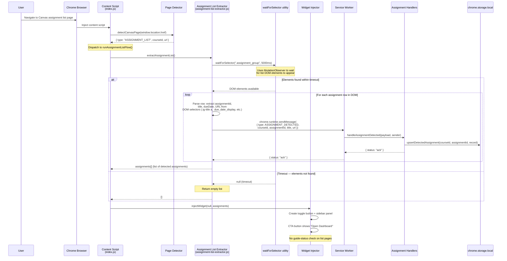
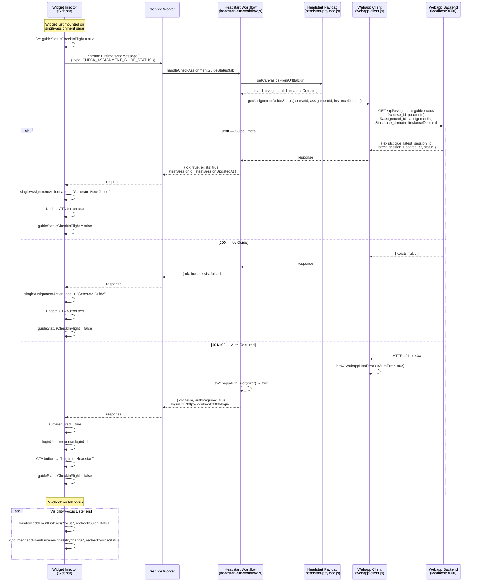
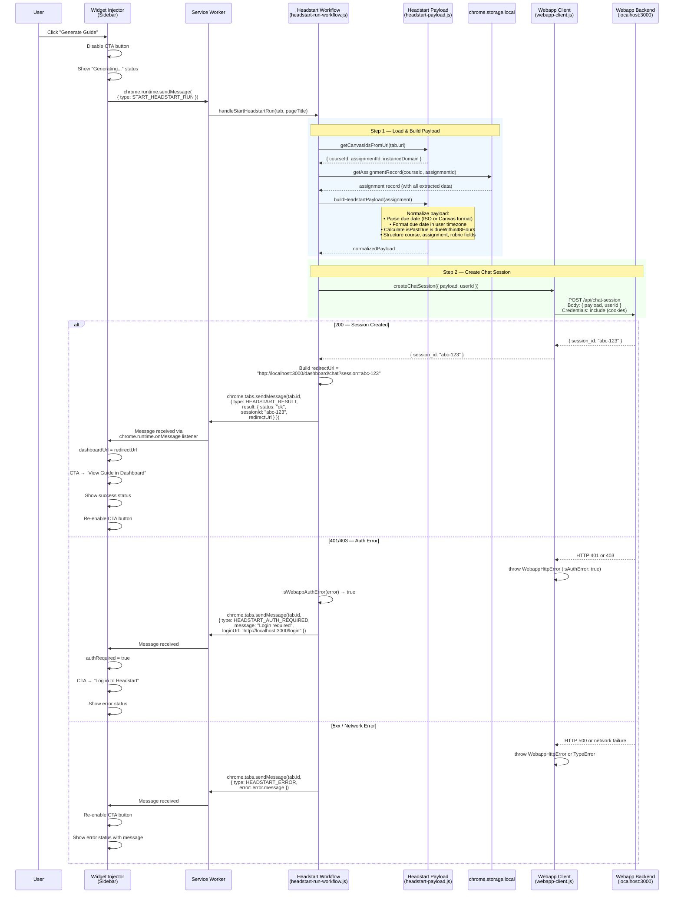
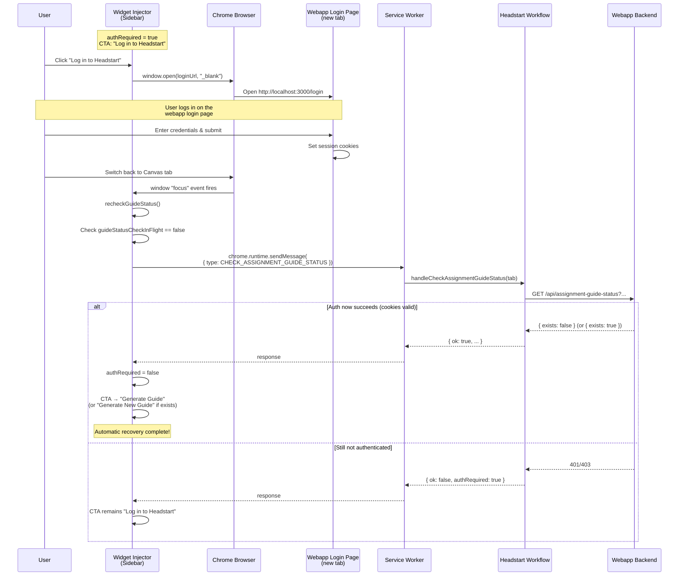
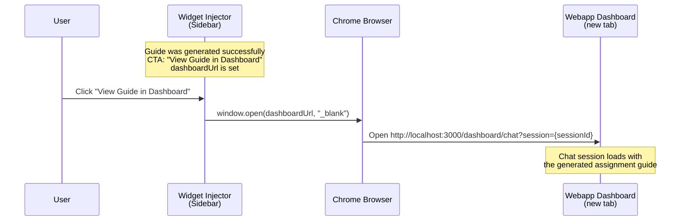
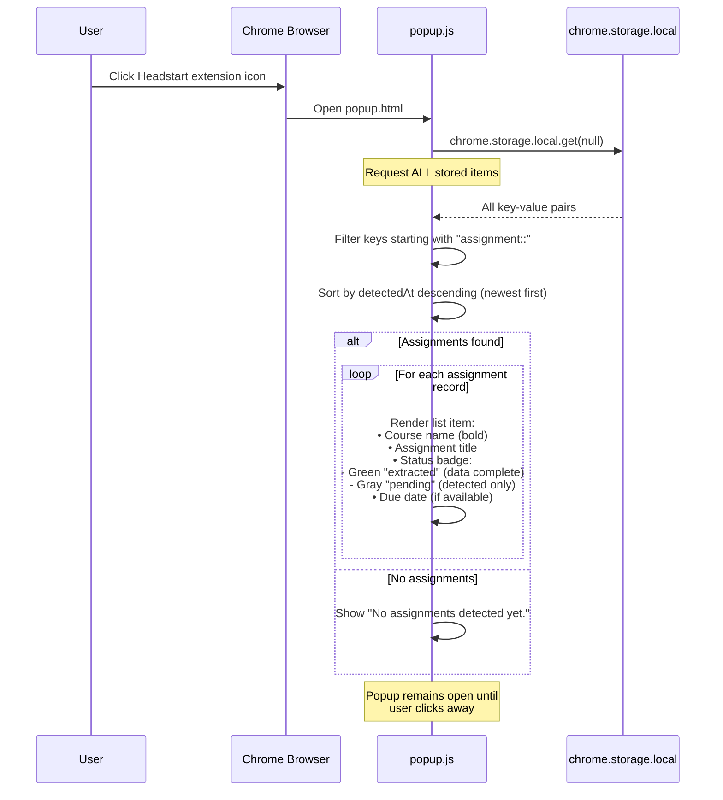
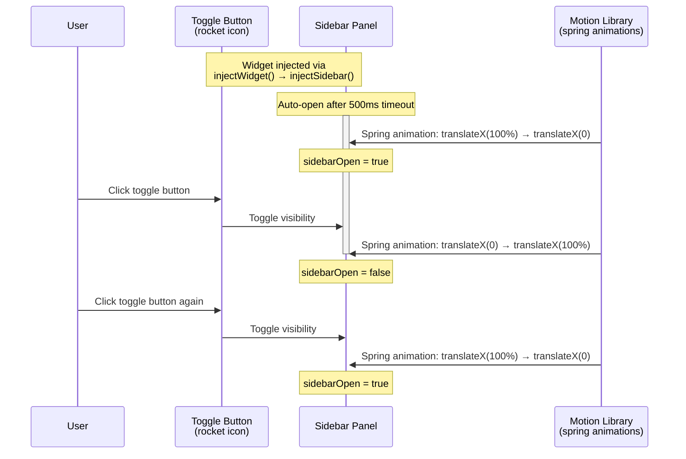
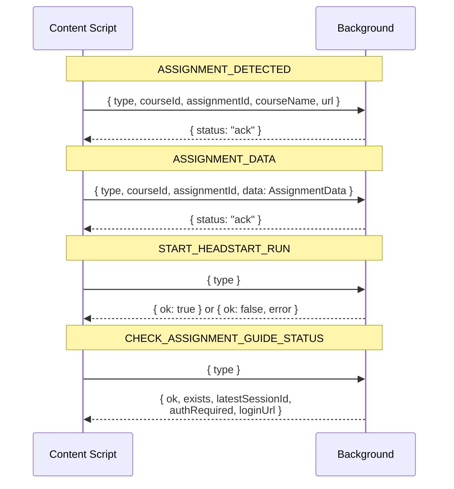
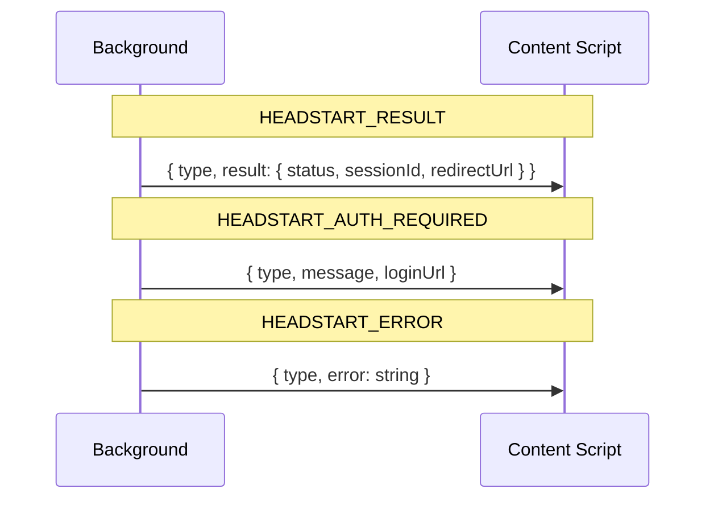
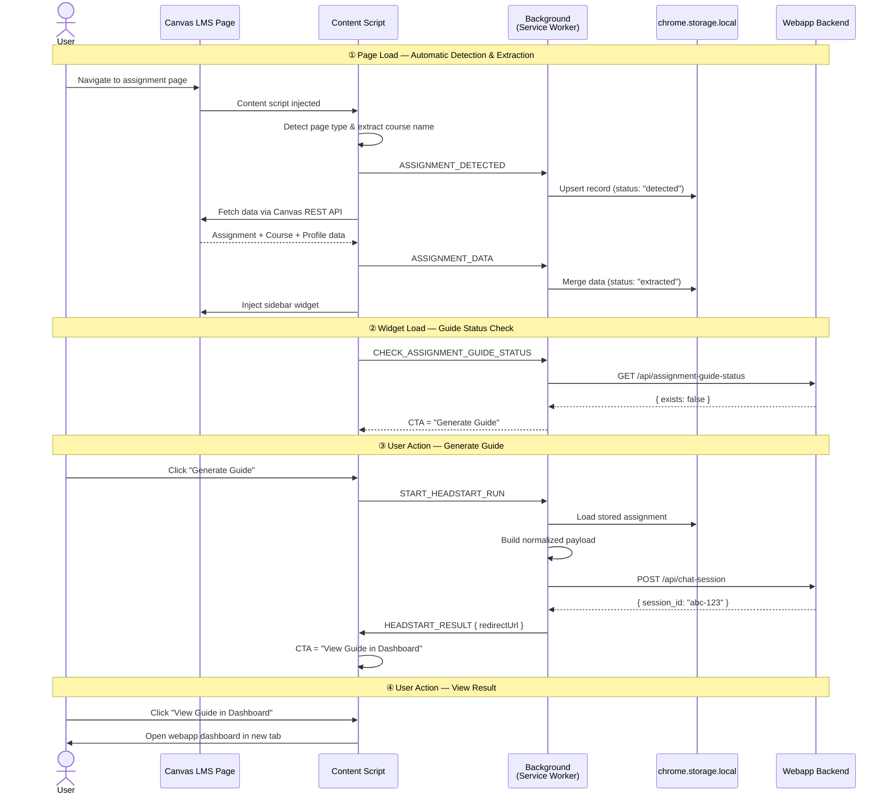

# Headstart Chrome Extension — Sequence Diagrams

This document details every interaction flow within the Headstart Chrome Extension using Mermaid sequence diagrams.

---

## Table of Contents

- [Headstart Chrome Extension — Sequence Diagrams](#headstart-chrome-extension--sequence-diagrams)
  - [Table of Contents](#table-of-contents)
  - [Architecture Overview](#architecture-overview)
  - [Flow 1: Page Detection \& Assignment Extraction (Single Assignment)](#flow-1-page-detection--assignment-extraction-single-assignment)
  - [Flow 2: Assignment List Detection \& Extraction](#flow-2-assignment-list-detection--extraction)
  - [Flow 3: Guide Status Check (Automatic on Widget Load)](#flow-3-guide-status-check-automatic-on-widget-load)
  - [Flow 4: Generate Guide](#flow-4-generate-guide)
  - [Flow 5: Authentication Recovery](#flow-5-authentication-recovery)
  - [Flow 6: View Guide in Dashboard](#flow-6-view-guide-in-dashboard)
  - [Flow 7: Popup — View Detected Assignments](#flow-7-popup--view-detected-assignments)
  - [Flow 8: Toggle Sidebar](#flow-8-toggle-sidebar)
  - [Message Protocol Summary](#message-protocol-summary)
    - [Content Script → Background (via `chrome.runtime.sendMessage`)](#content-script--background-via-chromeruntimesendmessage)
    - [Background → Content Script (via `chrome.tabs.sendMessage`)](#background--content-script-via-chrometabssendmessage)
  - [Storage Data Model](#storage-data-model)
  - [End-to-End Lifecycle (Consolidated)](#end-to-end-lifecycle-consolidated)

---

## Architecture Overview

```
┌─────────────────────────────────────────────────────────┐
│                Chrome Extension (MV3)                    │
│                                                          │
│  ┌──────────────────┐       ┌──────────────────────┐    │
│  │  Content Script   │       │  Service Worker       │    │
│  │  (Canvas pages)   │       │  (Background)         │    │
│  │                   │       │                       │    │
│  │  • page-detector  │       │  • message router     │    │
│  │  • extractors     │ chrome │  • assignment-handlers│    │
│  │  • widget-injector│◄─────►│  • headstart-workflow │    │
│  │  • workflows      │.runtime│  • headstart-payload  │    │
│  └──────────────────┘messaging└──────────┬───────────┘    │
│                                          │                │
│  ┌──────────────────┐       ┌────────────┴─────────┐    │
│  │  Popup            │       │  Storage Layer        │    │
│  │  (reads storage)  │──────►│  chrome.storage.local │    │
│  └──────────────────┘       └──────────────────────┘    │
└─────────────────────────────┬───────────────────────────┘
                              │ fetch (credentials: include)
                              ▼
                    ┌───────────────────┐
                    │  Webapp Backend   │
                    │  localhost:3000   │
                    │                   │
                    │  /api/chat-session│
                    │  /api/assignment- │
                    │    guide-status   │
                    └───────────────────┘
```

**Runtime Contexts:**

- **Content Script** — injected into Canvas LMS pages; detects assignments, extracts data, renders sidebar widget
- **Service Worker (Background)** — central message router; orchestrates storage and webapp API calls
- **Popup** — browser-action popup; reads detected assignments from `chrome.storage.local`

---

## Flow 1: Page Detection & Assignment Extraction (Single Assignment)

Triggered automatically when a user navigates to a Canvas single-assignment page (e.g., `/courses/123/assignments/456`).

```mermaid
sequenceDiagram
    participant User
    participant Browser as Chrome Browser
    participant CS as Content Script<br/>(index.js)
    participant PD as Page Detector<br/>(page-detector.js)
    participant AE as Assignment Extractor<br/>(assignment-extractor.js)
    participant CAE as Canvas API Extractor<br/>(canvas-api-extractor.js)
    participant RE as Rubric Extractor<br/>(rubric-extractor.js)
    participant WI as Widget Injector<br/>(widget-injector.js)
    participant BG as Service Worker<br/>(background/index.js)
    participant AH as Assignment Handlers<br/>(assignment-handlers.js)
    participant Store as chrome.storage.local
    participant CanvasAPI as Canvas REST API

    User->>Browser: Navigate to Canvas assignment page
    Browser->>CS: Inject content script (IIFE, on page load)

    Note over CS: Entry point runs immediately

    CS->>PD: detectCanvasPage(window.location.href)
    PD-->>CS: { type: "SINGLE_ASSIGNMENT", courseId, assignmentId, url }

    CS->>CS: Extract courseName from DOM<br/>(.mobile-header-title or<br/>#course_name_and_id span)

    Note over CS: Dispatch to runSingleAssignmentFlow()

    rect rgb(240, 248, 255)
        Note over CS,Store: Phase 1 — Notify Background of Detection
        CS->>BG: chrome.runtime.sendMessage(<br/>{ type: ASSIGNMENT_DETECTED,<br/>  courseId, assignmentId, courseName, url })
        BG->>AH: handleAssignmentDetected(payload, sender)
        AH->>Store: upsertDetectedAssignment(courseId, assignmentId, record)
        Store-->>AH: stored
        AH->>Browser: chrome.action.setBadge("!", tab) [if new]
        AH-->>BG: { status: "ack" }
        BG-->>CS: { status: "ack" }
    end

    rect rgb(240, 255, 240)
        Note over CS,CanvasAPI: Phase 2 — Extract Assignment Data
        CS->>AE: extractAssignmentData(courseId, assignmentId)

        AE->>CAE: fetchAssignmentFromAPI(courseId, assignmentId)

        par Parallel Canvas API Requests
            CAE->>CanvasAPI: GET /api/v1/courses/{courseId}/assignments/{assignmentId}<br/>?include[]=rubric_definition
            CanvasAPI-->>CAE: Assignment JSON (title, description, due_at,<br/>points, submission_types, rubric, attachments)
        and
            CAE->>CanvasAPI: GET /api/v1/courses/{courseId}
            CanvasAPI-->>CAE: Course JSON (name)
        and
            CAE->>CanvasAPI: GET /api/v1/users/self/profile
            CanvasAPI-->>CAE: Profile JSON (time_zone IANA)
        end

        Note over CAE: Check for PDF attachments in<br/>assignment.attachments[] and<br/>embedded file links in description HTML

        opt PDF attachments found
            loop For each PDF attachment
                CAE->>CanvasAPI: GET /api/v1/courses/{courseId}/files/{fileId}?download_frd=1
                CanvasAPI-->>CAE: File metadata with download URL
                CAE->>CanvasAPI: GET [presigned S3 URL]
                CanvasAPI-->>CAE: Binary PDF data
                Note over CAE: Convert PDF to base64
            end
        end

        CAE-->>AE: AssignmentData { title, courseName,<br/>descriptionHtml, descriptionText, dueDate,<br/>pointsPossible, submissionType, rubric,<br/>userTimezone, pdfAttachments }

        alt Canvas API fails (network error, 401, etc.)
            Note over AE: Fallback to DOM scraping
            AE->>AE: Scrape title, description, dueDate,<br/>pointsPossible, submissionType from<br/>DOM using CANVAS_SELECTORS
            AE->>RE: extractRubric()
            RE->>RE: Parse .rubric_container for criteria,<br/>ratings, points, descriptions
            RE-->>AE: Rubric object
        end

        AE-->>CS: AssignmentData (complete)
    end

    rect rgb(255, 248, 240)
        Note over CS,Store: Phase 3 — Send Extracted Data to Background
        CS->>BG: chrome.runtime.sendMessage(<br/>{ type: ASSIGNMENT_DATA,<br/>  courseId, assignmentId, data: AssignmentData })
        BG->>AH: handleAssignmentData(payload, sender)
        AH->>Store: mergeExtractedAssignment(courseId, assignmentId, data)
        Note over Store: Deep-merge: new non-empty values<br/>overwrite old; nulls preserve previous.<br/>Status updated to "extracted"
        Store-->>AH: merged record
        AH-->>BG: { status: "ack" }
        BG-->>CS: { status: "ack" }
    end

    rect rgb(248, 240, 255)
        Note over CS,WI: Phase 4 — Inject Sidebar Widget
        CS->>WI: injectWidget(assignmentData)
        WI->>WI: Create toggle button (rocket icon)<br/>+ sidebar panel in DOM
        WI->>WI: Apply CSS from headstart-widget.css
        WI->>WI: Set 500ms timeout to auto-open sidebar
        Note over WI: Widget now visible on page;<br/>auto-triggers guide status check (see Flow 3)
    end
```

---

## Flow 2: Assignment List Detection & Extraction

Triggered when a user navigates to a Canvas assignment list page (e.g., `/courses/123/assignments`).



---

## Flow 3: Guide Status Check (Automatic on Widget Load)

Triggered immediately after the widget is injected on a single-assignment page, and re-triggered on tab focus/visibility events.



---

## Flow 4: Generate Guide

Triggered when the user clicks the "Generate Guide" or "Generate New Guide" button.



---

## Flow 5: Authentication Recovery

Triggered when the user clicks "Log in to Headstart" and returns to the Canvas tab after logging in.



---

## Flow 6: View Guide in Dashboard

Triggered after a successful guide generation when the user clicks "View Guide in Dashboard".



---

## Flow 7: Popup — View Detected Assignments

Triggered when the user clicks the extension icon in the Chrome toolbar.



---

## Flow 8: Toggle Sidebar

The sidebar toggle button is always visible on Canvas assignment pages.



---

## Message Protocol Summary

### Content Script → Background (via `chrome.runtime.sendMessage`)



### Background → Content Script (via `chrome.tabs.sendMessage`)



---

## Storage Data Model

```
chrome.storage.local
│
├── assignment::185114::1261395     ← key format: assignment::{courseId}::{assignmentId}
│   {
│     courseId: "185114",
│     assignmentId: "1261395",
│     url: "https://canvas.ku.edu/courses/185114/assignments/1261395",
│     title: "Project Proposal",
│     courseName: "EECS 582 - Capstone",
│     dueDate: "2026-03-20T23:59:00Z",
│     pointsPossible: 100,
│     submissionType: "online_upload",
│     descriptionText: "Write a project proposal...",
│     rubric: {
│       title: "Proposal Rubric",
│       criteria: [
│         { description: "Clarity", longDescription: "...", points: 25, ratings: [...] },
│         ...
│       ]
│     },
│     userTimezone: "America/Chicago",
│     pdfAttachments: [
│       { filename: "requirements.pdf", base64Data: "JVBERi0xLj..." }
│     ],
│     detectedAt: "2026-03-16T14:30:00.000Z",
│     status: "extracted"     ← "detected" → "extracted"
│   }
│
├── assignment::185114::1261400
│   { ... }
│
└── ...
```

---

## End-to-End Lifecycle (Consolidated)


